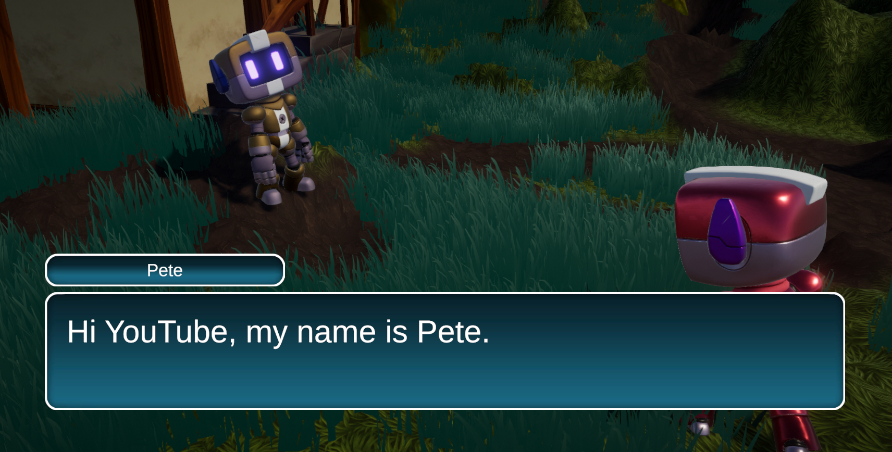

        

# Unity-story-tutorial

Tutorial repository how to create a story using StoryTime.

This is the official repository for the episode <b>#5</b> of the [Vamidicreations Youtube Channel](https://www.youtube.com/channel/UCUoly9B9KC5T4phZAU511cw)!

## Getting Started

These instructions will get you a copy of the project up and running on your local machine for development and testing purposes.

### Prerequisites

- Unity ver. 2020.3 or higher
- StoryTime ver. 1.6.3 or higher

### Running the project

After cloning or downloading the repository, open the root project folder in unity and press the Play button.

You can see a running demo of the project in [this video](https://youtu.be/4b8fQJF4A4Y).

## Built With

* [DOTween](http://dotween.demigiant.com/) - DOTween is a fast, efficient, fully type-safe object-oriented animation engine for Unity, optimized for C# users, free and open-source, with tons of advanced features
* [StoryTime](https://github.com/vamidi/StoryTime) - An data management package to create RPG games.

for more information look at the [documentations](https://vamidicreations.gitbook.io/storytime/)

## Authors

* **Valencio Hoffman** - [Github](https://github.com/vamidi)
 

## License

This project is licensed under the MIT License
